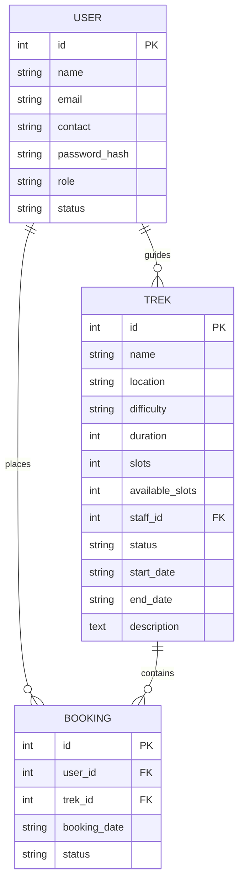
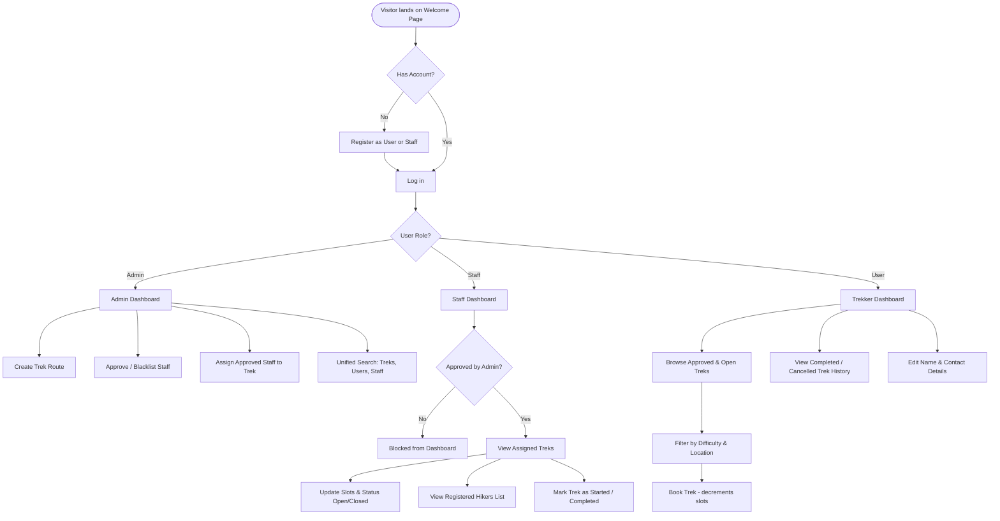

# Trekora 🏔️ - Trekking Management App

Trekora is a web application designed for adventure organizations to coordinate trekking events between administrators, guides (Trek Staff), and participants (Trekkers). 

It replaces spreadsheets and manual tracking with a robust system for booking slots, managing guide assignments, and recording trekking histories. The application adopts a modern, premium **Neobrutalist design** (high contrast, bold borders, flat drop shadows, and vibrant pastel accents).

---

## 🧑‍💻 Student Developer Info
* **Name:** R. Jayasree
* **IITM Student ID:** 23f2004869
* **Email:** [23f2004869@ds.study.iitm.ac.in](mailto:23f2004869@ds.study.iitm.ac.in)
* **LinkedIn:** [jayasree240306](https://www.linkedin.com/in/jayasree240306)

---

## 🛠️ Mandatory Tech Stack
This application complies 100% with the project guidelines:
* **Back-end:** Flask (Python 3)
* **Front-end:** Jinja2 templates, HTML5, Custom CSS, and Bootstrap 5 (No custom JavaScript is used to execute core requirements)
* **Database:** SQLite (SQLAlchemy ORM) - created programmatically on startup.

---

## 📐 System Architecture & Workflow

Trekora uses an MVC-inspired architecture where **Flask routes (Controllers)** manage the interaction between the **Jinja2 templates (Views)** and the **SQLite database tables (Models)**.

### Data Relationships


### Core User Workflow


---

## ✨ Features Checklist

* **Authentication:**
  - Secure passwords using `werkzeug.security` (Scrypt hashing).
  - Role-based redirection to dashboards.
  - Autofill block attributes (`autocomplete="off"`) on form fields.
* **Admin Controls:**
  - Dynamic charts and metrics (Treks count, Hikers count, Staff counts, Booking counts).
  - Staff registration requests validation (Approve/Reject) and blacklisting.
  - CRUD operations on trekking routes.
  - Unified search bar finding items by ID or Name.
* **Trek Staff Actions:**
  - Status updates (Open/Closed) and slots adjustment.
  - Live hiker participant registration tracking.
  - Lifecycle state markers (Started, Completed).
* **Trekker Experience:**
  - Trek catalog search filters (Difficulty tags: Easy/Moderate/Hard).
  - Instant slots check (prevents overbooking).
  - Profile editors and historical bookings log.
* **REST API Endpoints:**
  - `/api/treks`: JSON lists of all trek routes.
  - `/api/bookings`: JSON summary of bookings database.

---

## 🚀 Installation & Setup

Follow these simple steps to run the application on your computer:

### 1. Prerequisites
Ensure you have **Python 3** installed on your system. You can check this by running:
```bash
python --version
```

### 2. Clone/Extract the Project
Download and extract the project files into a folder on your computer.

### 3. Install Required Libraries
Open your terminal (PowerShell, Command Prompt, or terminal inside VS Code) and run the following command to install the required Flask libraries:
```bash
pip install flask flask-sqlalchemy
```

---

## 💻 How to Open and Run in VS Code

### Step 1: Open the Folder
1. Open **VS Code**.
2. Click **File** in the top menu and select **Open Folder...**
3. Browse and select the project root folder:
   `23f2004869-MAD1-Project-Trekking Management App V1`

### Step 2: Open the Integrated Terminal
* Open the terminal inside VS Code by pressing `Ctrl` + `` ` `` (backtick) or selecting **Terminal > New Terminal** from the menu.

### Step 3: Run the Server
In the VS Code terminal, run the following command to boot the application:
```bash
python app.py
```
On the first startup, this will automatically create the database file `trekora.db` and populate the default Administrator login.

### Step 4: Open in Web Browser
* In your terminal, look for the line: `* Running on http://127.0.0.1:5000`
* Press `Ctrl` and click the link to open Trekora in your browser!

---

## 🔑 Default login details for testing
You can log in immediately using the pre-seeded admin account:
* **Admin Email:** `admin@trekora.com`
* **Admin Password:** `admin123`
